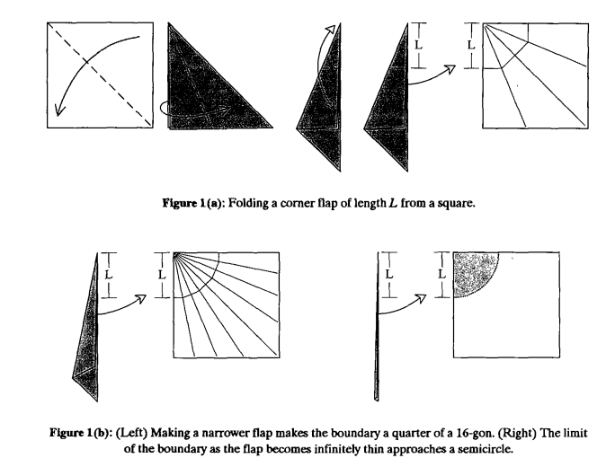
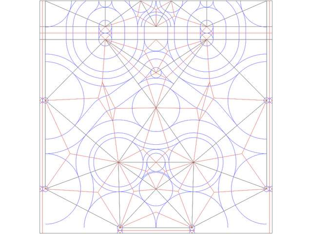
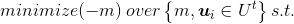
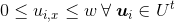
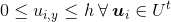
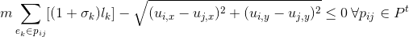

# Origami

The contents of this readme are:
1. Introduction
2. Program Walkthrough
- 2.1 The Origami Design Tool
- 2.2 Walkthrough
3. Circle Packing, Origami Mathematics, and Origami Design
- 3.1 The Circle-River Method of Origami Design
- 3.2 Defining the Scale Optimization
- 3.3 Definitions and Notation
- 3.4 Scale Optimization

### 1. Introduction

The art of origami paperfolding has gone through enormous innovation in the past twenty years through an unlikely source – circle packing mathematics. Now it is possible not just to fold simple cranes and boxes, but complex, anatomically correct sculptures of arthropods, deer, and other forms with many branches, long limbs, and unusual body geometry. The process of designing these models is both art and engineering, and the design can done computationally.

It works like this – take a subject that you want to want to fold into an origami model:


Draw a stick figure representation of the subject.


Then do a bunch of complicated math...

(packing circles with edge connections related to the topology of the original tree diagram! nonlinear optimization! Scale optimization! Edge optimization! Strain optimization! Univeral polgyon molecules!)

...to get a crease pattern. These are all of the folds that make up the structure of an origami model.


Fold on the creases to get an origami model with a basic structure just like the stick figure diagram. For the origami crane, this structure is a traditional fold called the "bird base" which can be seen on the right. On the left is the same structure from a different view. Notice the similarity to the stick figure diagram.


Unfortunately, math cannot do the rest. It's art!


### 2. Program Waltkhrough

#### 2.1 The Origami Design Tool

The Origami Design Tool does one piece of this process. In the program you can build two important components, the representation of the paper, and the representation of the model, and the relationship between the two. The paper is represented as a coordinate system, with a max width and height of 1.0 for squares, though rectangles are possible. 

To build the model representation, this is done by building a tree graph, where each edge has length and strain attribute. The mapping from the model to the paper is given by initial coordinates for each node on the graph. The purpose of the optimization is to find the coordinates for each node such that the distances between the nodes holds in a certain way (circle packing...) and so that the paper is used (covered by circles) in the most paper efficient manner. This is called a scale optimization, which is only one piece of the full number of mathematical tools involved for a complete crease pattern. What it does do is place the leaf nodes of the graph in the same locations as the tips of the limbs for an origami model. This is a significant insight into the structure of a model.

##### 2.2 Walkthrough

To install, create a virtual environment with a python2 interpreter and run 
```pip install -r requirements.txt```.
Make sure that the variables run_simple_examples and run_complex_examples are set to False and run_gui is set to True in the main.py file.
Run the program with 
```python main.py```

In the gui click "New Model" and put in a name and the height/width of your paper.


Submit this to see a picture of the coordinate system representing the paper. Input the first node, which will be the source node, or one of multiple source nodes. It represents the vertex that leaf nodes are attached to and it's length / strain does not matter. After submission the node should appear on the coordinate system.


When submitting additional nodes, use the radio box to select their 'source node'. An edge will be created between the new node and the source node. The length is the length of this edge. Strain is a number representing how distorted the edge length is allowed to be for a crease pattern to be found. Fixed edge lengths must have a strain of 0. Circles of size relative to the length are drawn on the paper frame. It's also important to note that the apparent length of the edge as drawn is not the same as the actual length.


When the full tree diagram is drawn then you can click scale optimization. A successful optimization will find new locations for the vertices so that the size of the paper is minimized while the all constraints are held. This is equivalent to finding the vertex locations such that the largest origami model having the topology of the original tree can be folded from the paper. (The picture is for a tree where all edges are length 1.0 and strain 0.0)


Note the similarity to the crane crease diagram in the introduction!


### 3. Circle Packing and Origami Mathematics

Let’s go through that in a bit more detail and highlight some vocabulary.

#### 3.1. The Circle-River Method of Origami Design

Just as animals are made out of limbs with portions of body in between, an **origami model** can be described as being made out of hinged flaps attached by portions of paper. During the folding process a basic shape with the appropriate number of limbs and geometry is made. This is called a **base.** After the base is made to have the general shape of the animal, the rest of the folds are aesthetic details which make the origami model look real. Things like eyes, ears, thinning of limbs and the shaping of wings.

A **flap** is a hinged portion of paper folded into a thin limb, often in the shape of a cone or long rectangle. Unfolded, an origami flap takes up an approximately circular portion of paper, where the tip of the flap is the center of the circle, and the length of the flap is the same as the radius. In an origami model where the paper was infinitely thin and the flap was accordian folded to it’s limit, the amount of paper it takes up approaches a circle. If the tip of the flap is on the edge or a corner of the paper, then the paper making up the flap only corresponds to the part of the circle that lands on the paper. A corner flap is mad out of a quarter circle of paper while a center flap is made of a full circle.



To design an origami base that can be folded into a particular figurine, the flaps of the model must be arranged on the the paper to be folded in a way that matches with the geometry. The adjacent limbs and features on the final model that correspond to different flaps need to have their circles be adjacent. So a head and two legs may be three different circles, two longer and one shorter that are all touching on the paper. Parts of the model that would not be limbs on a stick figure, such as the torso, must separate the circles on the paper. So there must be a distance of at least the length of the torso between, say, the rear and front pairs of legs. These portions of the model are called **rivers** and are the second piece in circle-river packing.



Here is the circle-river packing diagram as seen on the crease pattern for a very complicated figurine 
([lucanus cervus by brian chan](http://web.mit.edu/chosetec/www/origami/lucanus/)). 


#### 3.2. Defining the Scale Optimization

One of our goals is to build origami models that have the most efficient paper usage, or the largest flap-size to paper size ratio. Since center flaps use four times the amount of paper that corner flaps use (edge flaps use twice the amount that corner flaps use), an important result is that most of the flaps should be centered on the edges or corners of the paper where possible.


This problem is called the scale optimization problem, and is one of several nonlinear constrained optimizations involved in origami design. It is the only one that this problem solves.

#### 3.3. Definitions and Notation

A **tree diagram** is a **graph** representation of the animal form that is having it’s folding pattern designed. It is a set of i **nodes**, and **edges** E.

A **node** of the graph can be a **leaf node** or a **branch node**, where leaf nodes are only connected to one edge and branch nodes are connected to multiple. 


The graph **edges** e<sub>i</sub> contain two nodes, and have attributes **length** l<sub>i</sub> and **strain** (fractional distortion) σ<sub>i</sub>. 

The graph has a mapping to the paper and the coordinate system associated with it. After the mapping the nodes have a one to one relationship to a set of **vertices** **U**, where each vector vertex **u**<sub>i</sub> has coordinate variables u<sub>i,x</sub> and u<sub>i,y</sub>.

U<sup>t</sup> is the set of **leaf vertices** which correspond to leaf nodes.

 A **path** p<sub>ij</sub> is a sequence of edges which connect two nodes i and j. Define P to be the set of all paths, and P<sup>t</sup> to be the set of all **leaf paths**, or paths that connect two leaf nodes.

Each path has a length l<sub>ij</sub>, given by the sum of the strained lengths of the edges in the path.


The overall scale of the tree is *m*.

*w* and *h* are the width and height of the paper.


#### 3.4. Scale Optimization

The scale optimization problem is the optimzation of the positition of all leaf vertices and the overall scale. It is a nonlinear constrained optimization problem, with these constraints:



The coordinates of every vertex must lie within the paper boundaries:





The separation between any two vertices on the square must be at least as large as the scaled length of the path between their corresponding two nodes as measured along the tree.



To rewrite the equation a little more explicitly (moving the square root to the right hand side):

(paper scale) *(the sum of: (the path length between nodes i and j (including strain) ) ) [is less than] (the sum of(the distance between nodes i an j on the paper)) for all the paths between leaf nodes.
